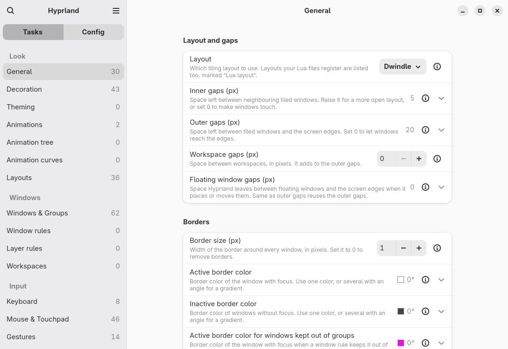

# Hyprtweaker

Change Hyprland settings without editing config files. Hyprtweaker shows Hyprland's options, keybinds, rules, monitors, animations and theming as settings you can change. A change applies to the running compositor and is written to your Lua config, and you can undo it.



*The General page, built by a widget probe with no compositor attached, so every value is Hyprland's default.*

Hyprtweaker 0.1.0 has no public release yet. You install it from this repository, and what has and has not been checked on a real machine is in [docs/v1-acceptance.md](docs/v1-acceptance.md).

## What you need

- **Hyprland 0.56 or later, running.** Hyprtweaker reads and writes the Lua config (`hl.*`) that Hyprland 0.56 introduced. Outside a running Hyprland session it opens read-only, and below Hyprland 0.56 it stays read-only and offers no import.
- **Lua** (the `lua` package, which includes `luac`). Hyprtweaker runs it to read its own files back and to check every file's syntax before writing it. Without it the app is read-only and says how to install it.
- A `~/.config/hypr/hyprland.lua` or `~/.config/hypr/hyprland.conf`, or neither: [first run](#first-run-and-your-existing-config) covers each.
- Python, PyGObject 3.50 or later (`python-gobject 3.50`), GTK 4 and libadwaita 1.7 or later (`libadwaita 1.7`). The package depends on `python`, `python-gobject`, `gtk4`, `libadwaita`, `glib2`, `hicolor-icon-theme`, `zstd` and `lua`.
- Optional, each only for what it names: `hyprland` (the compositor being configured), `matugen` and `wallust` (border colors from the wallpaper), `swww` and `awww` (wallpaper for presets).

### Which Hyprland versions

| Your Hyprland | What you get |
| --- | --- |
| 0.56.2 or 0.56.1 | A schema shipped with the app: every setting, with its description and limits. |
| Newer than 0.56.2 | The nearest shipped schema, plus the settings your Hyprland reports that it lacks, each marked "New in <version>" with a basic control until you update the app. |
| An older 0.56.x, or a version between two shipped ones | The nearest lower shipped schema. Best effort and untested. |
| Older than 0.56 | Read-only, under a banner that says why. Import is off. |

Everything below was checked against Hyprland 0.56.2.

## Install and run

From a checkout of this repository, the Arch package builds the latest commit of the default branch:

```sh
git clone https://github.com/danielbaldwin47/hyprland-settings-gui
cd hyprland-settings-gui/packaging
makepkg -si
```

pacman then tracks the files, so `pacman -R hyprtweaker` removes them cleanly. No one has recorded building this package with `makepkg` or installing it on a clean machine yet; the record says what has been checked. There is no AUR package and no Flatpak.

Without pacman, install with Meson from the repository root. `meson setup` refuses a PyGObject or libadwaita below the floors above. Meson does not track what it installs, so remove the files by hand or use the package route when you can:

```sh
meson setup build --prefix=/usr
meson compile -C build
sudo meson install -C build
```

To try it without installing, run it from the build directory. Inside a Hyprland session this uses your real config, so read [first run](#first-run-and-your-existing-config) first:

```sh
meson devenv -C build python3 -m hyprtweaker
```

Start it from your launcher ("Hyprtweaker") or with `hyprtweaker`, inside your Hyprland session.

## First run and your existing config

Hyprtweaker never asks you to delete your own config. On every start exactly one of these holds:

- **A `hyprland.lua` the app wrote.** Normal run.
- **A `hyprland.lua` the app did not write.** The app offers to import it ("You have a hyprland.lua this app did not write", with Convert... and Not now). Reading a Lua file means running it once, so the wizard asks first, and Not now is the default.
- **Only a `hyprland.conf`.** The pages show, read-only, under a banner: "Your config has not been converted yet: use Convert... at the top of the window." Nothing can be saved until you convert.
- **Neither.** The app starts a new config with every setting at Hyprland's default.

Until you answer an import offer, settings are visible but cannot be saved.

### The migration wizard

Convert... opens one dialog with five steps: Detect, Preview, Back up, Switch & verify, Keep or roll back.

1. **Preview** lists what conversion changed, in three classes: Info, Needs review, and Breakage it cannot fix, such as a script that runs `hyprctl dispatch`. The same list is saved as a loss report you can open later.
2. **Back up** copies your whole `~/.config/hypr` into `$XDG_STATE_HOME/hyprtweaker/backups/<timestamp>/` (by default `~/.local/state/hyprtweaker/backups/<timestamp>/`). Your `hyprland.lua` is renamed `hyprland.lua.bak` beside the new one, and a `hyprtweaker` folder already there is renamed `hyprtweaker.bak`. Your `hyprland.conf` is never moved or deleted.
3. **Switch & verify** reloads Hyprland on the new config and checks it. No config error and a matching keybind count are hard checks: if either fails, the wizard rolls back by itself. The workspace-rule count and monitor arrangement are reported under "What this could not confirm" and never roll back. Hyprland 0.56.2 cannot list window rules or layer rules, so for those the app can only confirm that Hyprland reports no config error. Settings that take effect at next login (`hl.env`, `hl.permission`) are noted, and autostart entries may run again.
4. **Keep or roll back** counts down 60 seconds. Keep makes the new config yours. Roll back puts back what you had, and the app tells you which folders it kept. Do nothing and it rolls back.

If the app or the session dies during the switch, the next start finds the unfinished switch and asks: "A configuration switch was not finished", with Keep it and Roll back (the default). If a Roll back cannot put your config back, it changes nothing further and gives the command that does. The app stays read-only, and offers to keep the new configuration, until the switch is settled.

If Hyprland will not start at all, from a TTY, for a Lua source: `mv ~/.config/hypr/hyprland.lua.bak ~/.config/hypr/hyprland.lua`. For a `.conf` source: `mv ~/.config/hypr/hyprland.lua ~/.config/hypr/hyprland.lua.switched`. Every loss report and the Keep or roll back page print the exact command for your switch, including the stamped names a second migration uses.

### What conversion proves, and what it does not

Conversion is not guaranteed lossless. The test corpus is seven public configurations; the evidence is on Hyprland 0.56.2 and says:

> Every rice in the test corpus (7 configurations) imports to a config that Hyprland 0.56.2 loads with no errors, and the first-run switch's live checks pass on each.
>
> For end-4, the corpus rice that ships its own hand-written Lua port, every setting both configs set lands on the same live value, and keybinds, animations, curves, monitor rules, workspace rules and layers match except where the port itself changed a line.
>
> Rendered side by side with three test windows, the imported end-4 was measured byte-identical to that port on 2026-10-02 once the port uses the same colour theme as the original config; the test holds it within 2/255 of blend rounding.
>
> These proofs cover the corpus rices on Hyprland 0.56.2; they do not promise identical pixels for other configurations, for tools or external state a config drives, or for other Hyprland versions.

Read the loss report before you press Keep.

Converting an Omarchy config works, but afterwards Omarchy's theme menu and Omarchy updates no longer change your Hyprland settings. The wizard says so before you switch, and Omarchy theme-switch continuity is not part of v1.

## Day to day

- **Changes apply at once.** There is no Apply button. Ctrl+Z undoes, and each setting has a reset.
- **Displays ask first.** A change that could blank a screen counts down, and reverts unless you confirm.
- **Your own Lua stays yours.** The app writes only its own folder, `~/.config/hypr/hyprtweaker/`, and a generated `hyprland.lua`. Setting up a theming tool also changes that tool's config, after a confirmation that lists every file. It never edits `user.lua`, which loads last so it overrides the app, and a setting it overrides is marked Overridden.
- **Files you edited by hand are respected.** If you edit one of the app's files, a change that would overwrite it is refused, with the reason and two choices: Keep my file (changes to it in the app are not saved until you replace it) or Replace file, which keeps a copy of your edit first in `$XDG_STATE_HOME/hyprtweaker/edited-copies/<timestamp>/`.
- **Theming.** The Theming page drives `matugen` and `wallust`, and sets the wallpaper through `awww` or `swww`. `hyprpaper` is detected and named but never driven. These integrations have been run only against stand-in tools in tests; a run with the real tools is an open check in the record.

## If something goes wrong

- **Hyprland rejects a change you made.** The app reverts it and shows "Hyprland rejected the change", with Details.
- **Hyprland reports a problem with the config.** A banner stays under the header until it is fixed. Its dialog lists each `file:line` with the actions that apply: Restore last good, Open file, Disable until fixed (for `user.lua`, reversibly) or Regenerate.
- **Restore last good** puts a file back to its newest version that Hyprland confirmed clean, for the files at fault only. If you edited the file by hand, a copy of your edit is kept first, and the toast has Show copy. Restore can only reach back to an import you kept when that import was fully read back afterwards. If it was not, the dialog says: "There is no verified restore point for general.lua since the import, because its settings could not all be read back when it was kept. Open the file to fix the error." Use the backup from the wizard in that case.
- **No keybinds load at all.** The app restores the files at fault on its own so you can reach a terminal, and reports it.
- **Removing a theming tool.** Remove on the Theming page keeps the tool's own output, and a Remove that could not finish says it was not removed.

## Where your files are

| What | Where |
| --- | --- |
| The app's Lua files and manifest | `~/.config/hypr/hyprtweaker/` |
| Your escape hatch, never touched | `~/.config/hypr/hyprtweaker/user.lua` |
| Backups from the wizard | `$XDG_STATE_HOME/hyprtweaker/backups/<timestamp>/` |
| Loss reports | `$XDG_STATE_HOME/hyprtweaker/reports/<timestamp>.md` and `.json` |
| Copies of files you chose to replace | `$XDG_STATE_HOME/hyprtweaker/edited-copies/<timestamp>/` |
| Snapshots and the change journal | `$XDG_STATE_HOME/hyprtweaker/` |
| App preferences | `$XDG_STATE_HOME/hyprtweaker/prefs.json` |

`$XDG_STATE_HOME` defaults to `~/.local/state`. Exports, loss reports, preferences and monitor profiles are written whole or not at all.

## Known limits

- **Untested on real hardware or tools.** HDR, real plugins, real multi-monitor setups, the real `matugen`, `wallust`, `awww` and `swww`, and an installed package on a clean machine have not been run. The record lists each as an owner check with the commands. Nothing here claims them.
- **Plugins.** The Scripting page edits your plugin load list. Hyprland 0.56.2 does not describe a plugin's own settings, so a plugin gets no setting rows.
- **A refused drag of an unset setting** leaves the compositor showing the dragged value until the next reload.
- **Not in v1:** Omarchy theme-switch continuity, an AUR package, a Flatpak, plugin settings as rows.

## Report a problem

Open an issue at https://github.com/danielbaldwin47/hyprland-settings-gui/issues. Include the Hyprtweaker version (0.1.0), the output of `hyprctl version`, what you did, and the Details text from the banner or toast if there was one. For a conversion problem, attach the loss report after reading it: it can quote lines from your config.

## Build and test from source

The dev loop is `meson setup build && meson devenv -C build python3 -m hyprtweaker`. `meson setup build -Dtests=enabled && meson test -C build` runs the unit, static and UI tiers and validates the desktop entry and metainfo; the UI tier needs Xvfb and `dbus-daemon`. Architecture decisions are in [docs/adr](docs/adr) and the glossary in [CONTEXT.md](CONTEXT.md).

## License

GPL-3.0-or-later. See [LICENSE](LICENSE).
