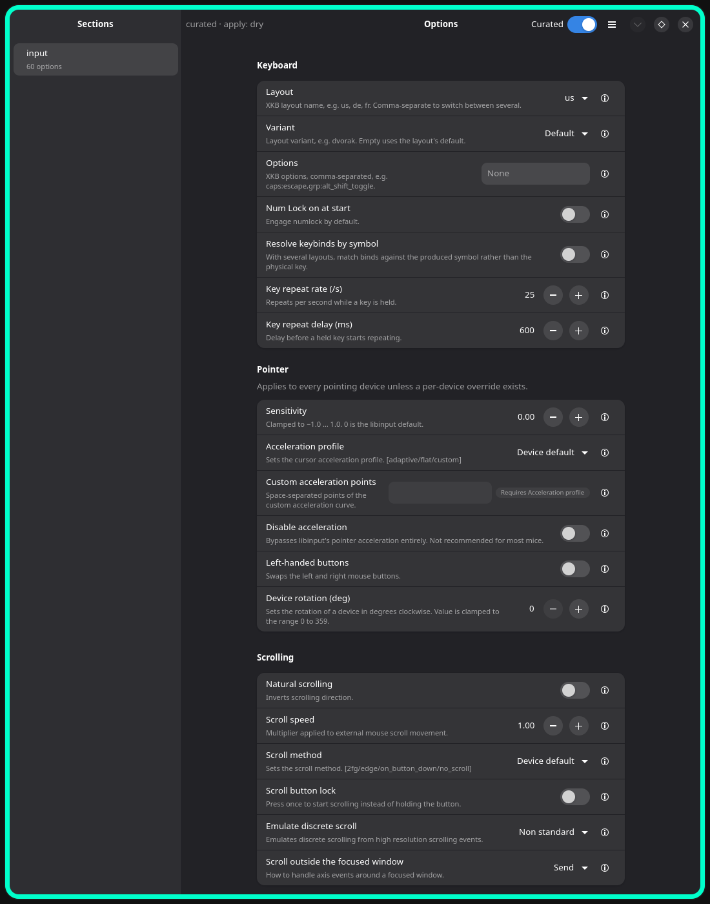
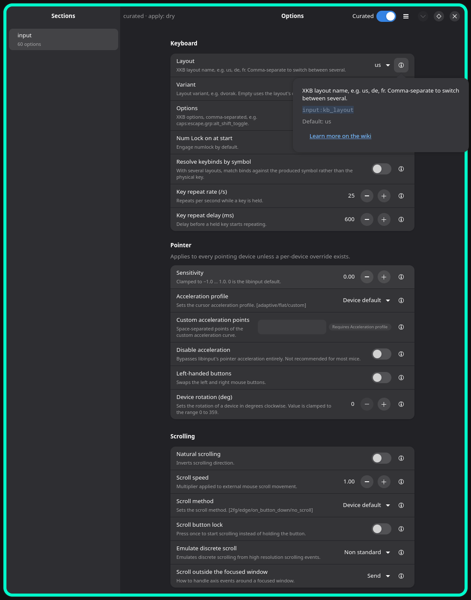
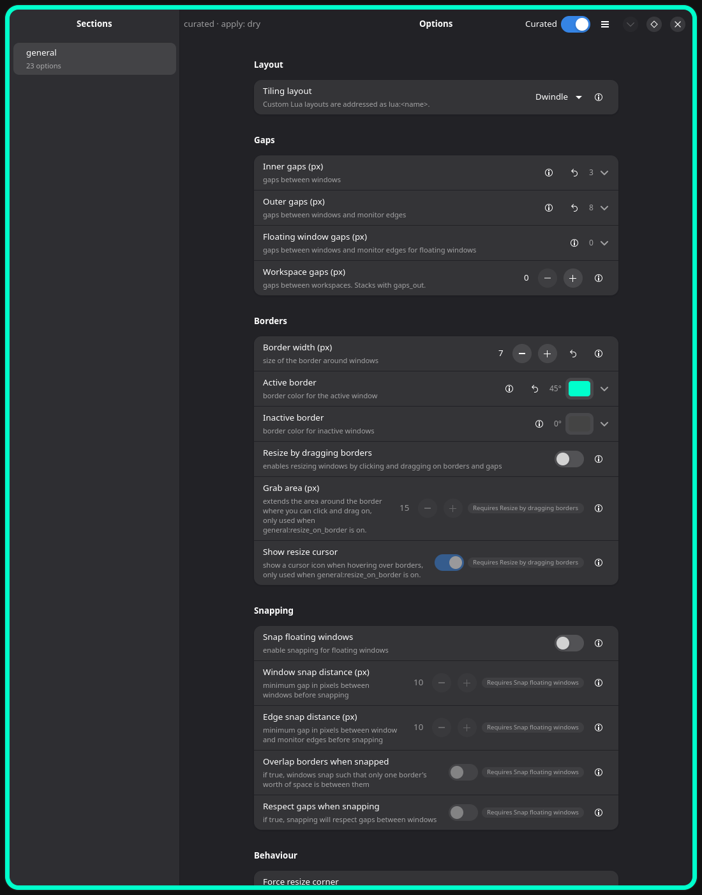
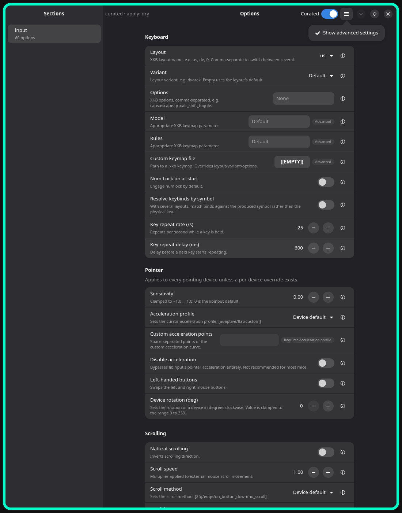

# Row catalogue

The presentation vocabulary for generated option Rows, decided in ADR-0013 (ticket #19). Screenshots are from the re-prototyped #8 codebase running in a nested Hyprland with the real Schema + Overlay; they show the conventions, not final visual design.

## Anatomy of a Row

Every generated Row is an `AdwActionRow` (or `AdwExpanderRow` / specialised subclass) with:

- **Title** — curated title, else derived from the option leaf name.
- **Subtitle** — the option description (curated `help` when the Overlay overrides). *Not* the dotted key.
- **Typed control** — switch, spin, dropdown, entry, colour button, expander… per the Schema widget mapping.
- **Suffix strip**, fixed order left→right:

  | Slot | When shown | Form |
  | --- | --- | --- |
  | State pills | `visibility: advanced` / `restart` flag | small pill: "Advanced", "Restart" |
  | Value summary | ExpanderRows only | dim-label preview of the collapsed value |
  | Dependency badge | `depends_on` unmet | pill "Requires \<option title\>", click navigates to that Row |
  | Reset | Option is modified | `edit-undo-symbolic` flat button; tooltip "Reset to default: \<value\>"; action = **Unset** (ADR-0005) |
  | Help popover | always (curated view) | ⓘ `MenuButton` → popover |

## The rows

### String rows

`AdwActionRow` + `GtkEntry` suffix (never `AdwEntryRow`, which has no subtitle slot). Nullable strings put the `null_label` in `placeholder-text` — an unset value reads "Device default"/"None", never a blank box. Commit on Enter / focus-out.

Shown: **Options** (`input:kb_options`) as plain entry with "None" placeholder; **Layout**/**Variant** curated into pickers; **Custom acceleration points** disabled with a "Requires Acceleration profile" badge — control insensitive, text readable.

### Help popover

The ⓘ gathers all reference material: help text, dotted key (selectable, `<tt>`), default value, "Learn more on the wiki" (`help_url` anchor). This is where the dotted key lives now; search still indexes it.

### Modified state, reset, dependency badges, value summaries

Shown: reset arrows only on the four modified Rows (Inner/Outer gaps, Border width, Active border); "Requires Resize by dragging borders" badges on **Grab area** / **Show resize cursor** with only the control desensitised; gradient ExpanderRows collapsed with swatch + angle ("45°"); css-gaps summaries as plain numbers.

Value summary formats:

| Type | Collapsed summary |
| --- | --- |
| gradient | swatch strip + "45°" |
| css-gaps | "8" (uniform) / "8 · 12 · 8 · 12" (top·right·bottom·left) |
| vec2 | "0.0, 0.5" |

### Advanced disclosure

One global **"Show advanced settings"** switch in the hamburger menu. Advanced Rows render in place with an "Advanced" pill; the `hidden` tier (debug/quirks/experimental/input-capture) appears only in the Config view with the switch on. Search indexes everything regardless and reveals a hit one-off.

Shown: **Model**, **Rules**, **Custom keymap file** appear with Advanced pills once the switch is on. The `[[EMPTY]]` text on Custom keymap file is a prototype gap — that option lacks a `null_label` in the test Overlay, which is exactly the leak the ADR-0011 completeness test must catch (every nullable option needs a `null_label`).

## Implementation notes for the Row factory (`ui/rows/`)

- The factory must expose each Row's inner control so the dependency badge can desensitise it directly — the prototype walked the widget tree; the real factory returns the handle.
- "Modified" is the ADR-0005 tri-state: the Option is modified exactly when the model emits it. (Superseded the per-type is-default check during #57 — see the amendment on ADR-0013 §6. The check was prototype #8's only option because #8 had no model; comparing values would hide the reset arrow on an Option deliberately set to today's default, which is the one Row that most needs it.)
- Pills are `GtkLabel` with a `.pill` style class; summaries `.value-summary` + `dim-label`.
- **The suffix strip is one box, added once.** `AdwActionRow.add_suffix` appends but
  `AdwExpanderRow.add_suffix` *prepends*, so adding the five slots one call at a time puts
  the ⓘ at opposite ends of the strip depending on which Row type an Option resolved to —
  observed on the running app during #58, where every expander wore its chrome backwards.
  Building the strip as a `GtkBox` and handing the Row that one widget makes the order a
  property of the convention rather than of the widget.
- **An expander's editor goes in as one child**, not as a sub-Row per part. That is what
  leaves the factory a single control handle to hand back, so the dependency badge and the
  read-only state can desensitise the editor without touching the Row's own text (ADR-0013
  §3) and without walking the widget tree for it.
- **Continuous vs discrete is a property of the widget, not of the type.** The only control
  in the generated Rows that moves under a held pointer is the gradient's angle slider, so
  it is the only one wired to the Eval preview tier (ADR-0010); a colour dialog is modal and
  a spin button is discrete, and both commit through the normal Apply path.
